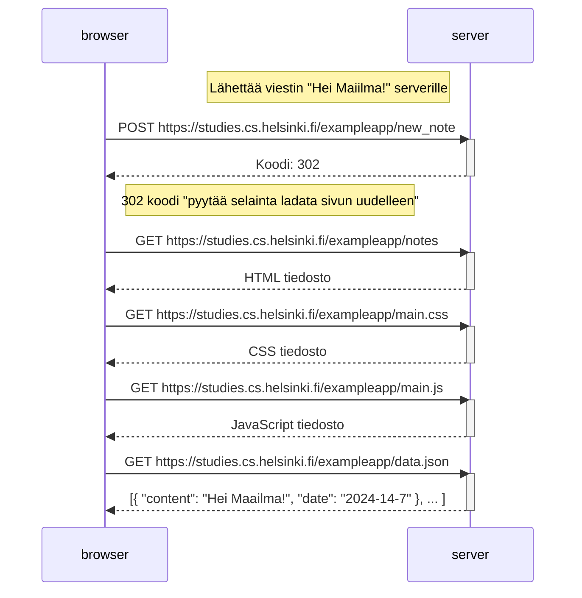

Tekstikenttään kirjoitetaan "Hei Maailma!" ja painetaan "Save" painiketta

```mermaid
sequenceDiagram

    participant browser
    participant server

    Note left of server: Lähettää viestin "Hei Maiilma!" serverille

    browser->>server: POST https://studies.cs.helsinki.fi/exampleapp/new_note
    activate server
    server-->>browser: Koodi: 302
    deactivate server

    Note right of browser: 302 koodi "pyytää selainta ladata sivun uudelleen"

    browser->>server: GET https://studies.cs.helsinki.fi/exampleapp/notes
    activate server
    server-->>browser: HTML tiedosto
    deactivate server

    browser->>server: GET https://studies.cs.helsinki.fi/exampleapp/main.css
    activate server
    server-->>browser: CSS tiedosto
    deactivate server

    browser->>server: GET https://studies.cs.helsinki.fi/exampleapp/main.js
    activate server
    server-->>browser: JavaScript tiedosto
    deactivate server

    browser->>server: GET https://studies.cs.helsinki.fi/exampleapp/data.json
    activate server
    server-->>browser: [{ "content": "Hei Maailma!", "date": "2024-14-7" }, ... ]
    deactivate server
```
