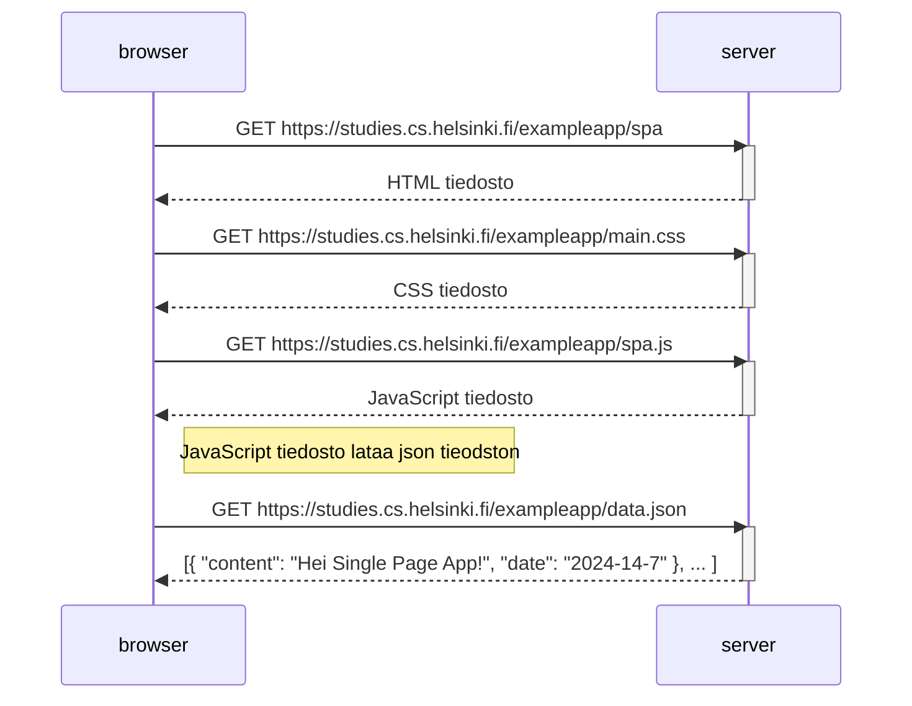

Single page app avataan selaimessa

```mermaid
sequenceDiagram

  participant browser
  participant server

  browser->>server: GET https://studies.cs.helsinki.fi/exampleapp/spa
  activate server
  server-->>browser: HTML tiedosto
  deactivate server

  browser->>server: GET https://studies.cs.helsinki.fi/exampleapp/main.css
  activate server
  server-->>browser: CSS tiedosto
  deactivate server

  browser->>server: GET https://studies.cs.helsinki.fi/exampleapp/spa.js
  activate server
  server-->>browser: JavaScript tiedosto
  deactivate server

  Note right of browser: JavaScript tiedosto lataa json tieodston

  browser->>server: GET https://studies.cs.helsinki.fi/exampleapp/data.json
  activate server
  server-->>browser: [{ "content": "Hei Single Page App!", "date": "2024-14-7" }, ... ]
  deactivate server

```
